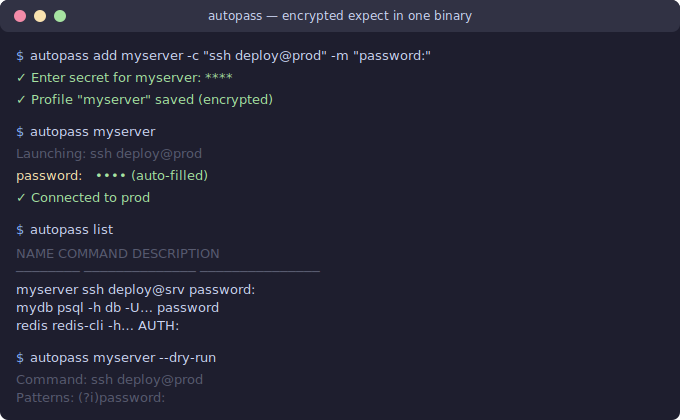

# passauto

[](https://github.com/lifefinity/passauto/actions/workflows/ci.yml)
[](https://github.com/lifefinity/passauto/actions/workflows/codeql.yml)
[](https://codecov.io/gh/lifefinity/passauto)
[](https://goreportcard.com/report/github.com/lifefinity/passauto)

[中文文档](docs/README_zh.md)

**Encrypted expect in one binary** — auto-answer interactive prompts (passwords, PINs, passphrases) with secrets encrypted at rest.

<p align="center">
  
</p>

## Why passauto?

| Tool | Scripting | Secret Storage | Cross-Platform | Learning Curve |
|------|-----------|----------------|----------------|----------------|
| **passauto** | No script needed — one-liner setup | AES-256-GCM, key derived from SSH key | Windows (ConPTY) + Linux/macOS (PTY) | Minimal |
| expect/pexpect | TCL/Python scripts | None (plaintext in scripts) | Linux/macOS only | Moderate |
| sshpass | Single command only | Plaintext flag or env var | Linux only | Low |
| ansible vault | Playbook-level | Encrypted vault | Via Ansible | High |

## Installation

### Download Binary

Download the latest release from [Releases](https://github.com/lifefinity/passauto/releases/latest):

```bash
# Linux (amd64)
curl -sL https://github.com/lifefinity/passauto/releases/latest/download/passauto-linux-amd64 -o passauto
chmod +x passauto && sudo mv passauto /usr/local/bin/

# macOS (Apple Silicon)
curl -sL https://github.com/lifefinity/passauto/releases/latest/download/passauto-darwin-arm64 -o passauto
chmod +x passauto && sudo mv passauto /usr/local/bin/

# Windows — download passauto-windows-amd64.exe from Releases page
```

### Build from Source

```bash
git clone https://github.com/lifefinity/passauto.git
cd passauto && make build
```

## Quick Start

```bash
# Build
make build    # → bin/passauto.exe (with version info)

# 1. Add a profile
passauto add -c "ssh user@server" -m "password:" myserver

# 2. Run it — password auto-filled
passauto myserver

# 3. Check what you have
passauto list
```

## How It Works

```
passauto myserver
    │
    ├─ Load profile from ~/.passauto/data.json
    ├─ Derive AES key from SSH private key (HKDF-SHA256)
    ├─ Decrypt stored secret
    ├─ Launch command in pseudo-terminal
    ├─ Watch output → match regex → auto-type secret
    └─ Process exits normally
```

### KMS Mode (Team/Enterprise)

When a profile has `--kms-key-id` set, passauto uses AWS KMS envelope encryption instead of SSH key derivation:

```
passauto myserver
    ├─ Call KMS GenerateDataKey -> get plaintext DEK + encrypted DEK
    ├─ Encrypt secret with DEK (AES-256-GCM)
    └─ Store encrypted DEK + ciphertext together
```

## Examples

### Common Profiles

```bash
# SSH server
passauto add -c "ssh deploy@prod-server" -m "password:" prod

# PostgreSQL
passauto add -c "psql -h db.example.com -U admin mydb" -m "password" -p "=>\s*$" mydb

# MySQL
passauto add -c "mysql -h db.example.com -u root -p" -m "password:" mysql-prod

# Docker registry
passauto add -c "docker login registry.example.com -u ci" -m "password:" docker-reg

# Sudo
passauto add -c "sudo apt upgrade -y" -m "password" apt-upgrade

# Kerberos
passauto add -c "kinit admin@EXAMPLE.COM" -m "password for" krb

# Oracle SQL*Plus
passauto add -c "sqlplus admin@orcl" -m "password:" oracle-prod

# Redis CLI (AUTH)
passauto add -c "redis-cli -h cache.example.com" -m "password:" redis
```

### TOTP / 2FA

Auto-fill time-based one-time passwords alongside regular secrets:

```bash
# TOTP-only profile
passauto add -c "vpn-connect" -m "Verification code:" vpn --totp

# Password + TOTP (two-step auth)
passauto add -c "ssh admin@server" -m "password:" --totp-match "Verification code:" myserver

# Update TOTP seed
passauto update myserver --totp-secret
```

The TOTP seed is encrypted at rest. Codes are generated just-in-time (RFC 6238, 6 digits, 30s period).

### Post-Login Commands

Chain commands after the password is auto-filled:

```bash
# Run SQL queries after connecting
passauto mydb --then "SELECT now();" --then "\q"

# Execute a script file
passauto mydb --script queries.sql

# Combined
passauto mydb --then "\timing on" --script queries.sql --then "\q"
```

### Update a Profile

```bash
# Change only the secret
passauto update prod --secret

# Change the command
passauto update prod -c "ssh newuser@prod-server"

# Change match pattern and timeout
passauto update mysql-prod -m "enter password:" -t 60s

# Change description
passauto update prod -d "Production deployment server"

# Set post-login steps
passauto update mydb --then "\timing on" --then "SET search_path TO app;"

# Set post-exit commands
passauto update krb --after "klist" --after "echo done"

# Enable case-sensitive matching
passauto update myserver --case-sensitive

# Update TOTP seed
passauto update myserver --totp-secret

# Add/change TOTP match
passauto update myserver --totp-match "OTP:"
```

### Quiet Mode

Run without terminal output (useful for scripts/CI):

```bash
# Silent execution — password still auto-filled
passauto mydb --quiet --script queries.sql

# Short form
passauto mydb -q --then "SELECT 1;"

# Capture output to file (without --quiet, stdout has PTY output)
passauto mydb --script queries.sql > result.txt
```

## Commands

| Command | Description |
|---------|-------------|
| `passauto <profile> [-s service]` | Run a profile with auto-answering |
| `passauto add <profile>` | Create a new profile |
| `passauto update <profile>` | Update specific fields of a profile |
| `passauto list` | Show all profiles |
| `passauto remove <profile>` | Delete a profile |
| `passauto change-key <path>` | Switch to a new SSH key for encryption |
| `passauto export <file>` | Export profiles to JSON (without secrets) |
| `passauto import <file>` | Import profiles from JSON |
| `passauto backup <dir>` | Backup key + data to a directory |
| `passauto restore <dir>` | Restore key + data from a backup |
| `passauto completion <shell>` | Generate shell completion (bash/zsh/fish/powershell) |
| `passauto version` | Print version info |
| `passauto init` | First-time setup |

## Pattern Matching

- **Case-insensitive by default** — `"password:"` matches `Password:`, `PASSWORD:`, etc.
- Use `--case-sensitive` flag when adding/updating a profile for exact case matching
- Patterns are Go regular expressions (e.g. `"password|passphrase"` matches either)

## Multi-Service Profiles

When a server has multiple services (SSH, PostgreSQL, Oracle, etc.), use `-s` to disambiguate:

```bash
# Add multiple services for the same server
passauto add -c "ssh admin@prod" -m "password:" prod -s ssh
passauto add -c "psql -h prod -U admin" -m "password" prod -s pg
passauto add -c "sqlplus admin@prod-orcl" -m "password:" prod -s oracle

# Run -- if name is unique, runs directly
passauto prod              # multiple matches -> shows selection menu
passauto prod -s ssh       # exact match -> runs directly

# List shows service column
passauto list
# NAME   SERVICE   COMMAND                          DESCRIPTION
# prod   ssh       ssh admin@prod                   ...
# prod   pg        psql -h prod -U admin            ...
# prod   oracle    sqlplus admin@prod-orcl           ...
```

Uniqueness is enforced on `(name, service)` pairs. Profiles without `-s` have an empty service field.

## Keychain Cache

passauto caches the derived AES encryption key in your OS keychain (macOS Keychain, Linux secret-service, Windows Credential Manager) to avoid re-reading the SSH key on every run.

- Cache TTL: 1 hour (auto-expires)
- Per-profile isolation (each profile caches independently)
- Disable with `--no-cache` flag

```bash
passauto prod              # first run: reads SSH key, caches derived key
passauto prod              # subsequent: uses cached key (faster)
passauto prod --no-cache   # bypass cache, re-derive from SSH key
```

## KMS Envelope Encryption

For team/enterprise use, passauto supports AWS KMS envelope encryption. Instead of deriving keys from a local SSH key, KMS generates and manages data encryption keys.

```bash
# Add a profile with KMS encryption
passauto add -c "ssh admin@prod" -m "password:" prod --kms-key-id arn:aws:kms:us-east-1:123456:key/abc-def

# Existing profiles: switch to KMS
passauto update prod --kms-key-id arn:aws:kms:us-east-1:123456:key/abc-def

# Run as normal -- KMS decryption is transparent
passauto prod
```

Requirements:
- AWS credentials configured (`~/.aws/credentials` or environment)
- IAM permissions: `kms:GenerateDataKey`, `kms:Decrypt` on the specified key

## Backup & Restore

```bash
# Backup key and encrypted data to a directory
passauto backup /mnt/usb/passauto-backup

# Restore on a new machine
passauto restore /mnt/usb/passauto-backup

# Overwrite existing data
passauto restore ~/backup --force
```

Export/import profiles *without* the encryption key (for sharing configs):

```bash
passauto export profiles.json    # secrets excluded
passauto import profiles.json    # merge with existing (--force to overwrite)
```

## Security

- Secrets encrypted with **AES-256-GCM** (random nonce per secret)
- Encryption key derived from your **SSH private key** via HKDF-SHA256 — never stored on disk
- If no SSH key exists, a dedicated ed25519 key is auto-generated at `~/.passauto/passauto_key`
- Data file at `~/.passauto/data.json` with 0600 permissions
- No plaintext secrets anywhere

## Platform Support

| Platform | Method |
|----------|--------|
| Windows 10+ | ConPTY |
| Linux | PTY (creack/pty) |
| macOS | PTY (creack/pty) |

## Documentation

- [Examples](docs/examples.md) — complete cookbook for SSH, databases, CI, git, and more
- [User Guide](docs/user-guide.md) — detailed usage, flags, troubleshooting
- [Architecture](docs/architecture.md) — component design, data flow, security model
- [Development](docs/development.md) — building, testing, contributing
